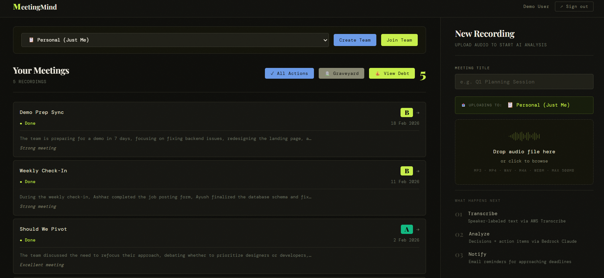
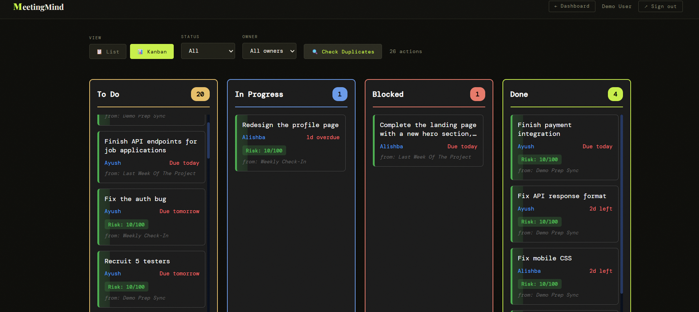
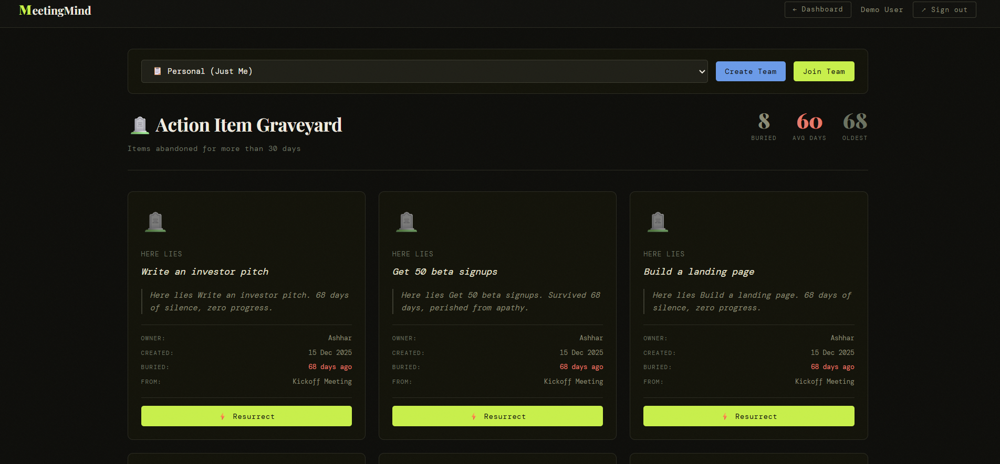
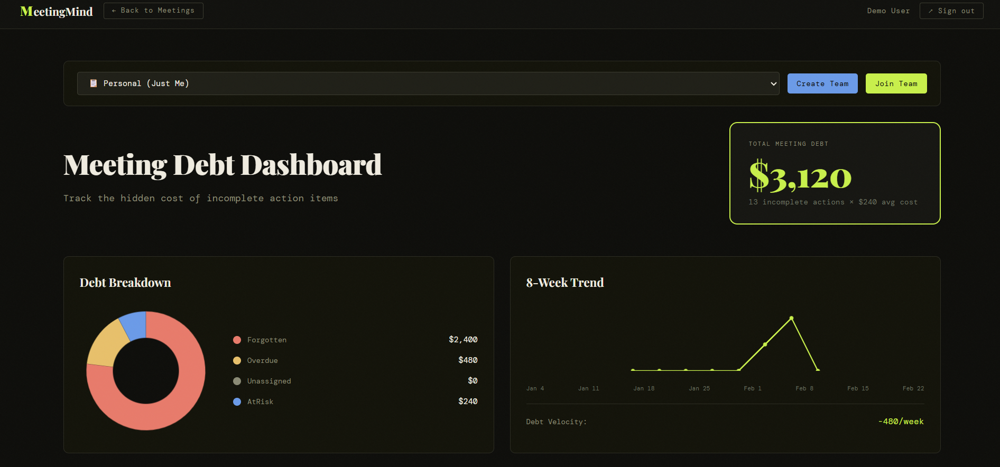

<div align="center">

# MeetingMind

### AI-Powered Meeting Intelligence Platform

[](https://aws.amazon.com)
[](https://www.python.org)
[](https://react.dev)
[](https://aws.amazon.com/serverless/)
[](LICENSE)

**[Live Demo](https://dcfx593ywvy92.cloudfront.net)** • **[Documentation](docs/)** • **[Architecture](docs/ARCHITECTURE.md)** • **[API Reference](docs/API.md)**

*Built for AWS AIdeas Competition 2026*

</div>

---

## 🎯 The Problem

Organizations lose **$37 billion annually** to unproductive meetings. The statistics are alarming:

- **67%** of meetings end without clear action items
- **44%** of action items are never completed  
- **$75/hour** average cost per attendee in wasted time
- Teams struggle to track commitments across multiple meetings
- Duplicate work goes undetected, wasting resources
- No visibility into meeting ROI or productivity patterns

**The core issue?** Meetings generate valuable decisions and commitments, but this information disappears into scattered notes, forgotten emails, and lost context. Teams need a system that transforms meeting chaos into structured, actionable intelligence.

---

## 💡 The Solution

MeetingMind is an AI-powered platform that transforms meeting audio into actionable intelligence. Upload a recording, and within minutes receive:

- **Structured transcripts** with speaker identification
- **Extracted decisions** and key outcomes
- **Action items** with automatic owner assignment and deadlines
- **Risk predictions** for each commitment using ML algorithms
- **Duplicate detection** to prevent redundant work
- **Meeting debt analytics** quantifying the cost of incomplete actions

Built entirely on AWS serverless architecture, MeetingMind scales automatically, costs only what you use, and maintains enterprise-grade security.

---

## 📸 Product Showcase

<div align="center">

### 📊 Dashboard - Meeting Overview


*Track all meetings with AI-generated health scores (A-F grades), team collaboration, and quick actions*

---

### 📋 Kanban Board - Smart Action Management


*Drag-and-drop interface with risk scoring, duplicate detection, and real-time updates*

---

### 🪦 The Graveyard - Accountability Visualization


*Unique feature showing abandoned commitments with resurrection mechanic*

---

### 💰 Meeting Debt Dashboard - Financial Impact


*Quantify the cost of incomplete work with breakdown and trend analysis*

</div>

---

## ✨ Core Features

### 🎙️ Intelligent Audio Processing

Transform meeting recordings into structured data using AWS AI services:

- **Multi-format support:** MP3, MP4, WAV, M4A, WEBM (up to 500MB)
- **Speaker diarization:** Automatic identification of who said what
- **Multi-model AI fallback:** Claude Haiku → Nova Lite → Nova Micro for 100% uptime
- **Processing time:** 2-5 minutes for a 30-minute meeting

### 📊 Smart Action Management

Never lose track of commitments with an intelligent Kanban board:

- **Drag-and-drop interface:** Move items between To Do, In Progress, Blocked, and Done
- **Risk scoring:** ML-powered predictions based on deadline, owner, clarity, and age
- **Semantic duplicate detection:** AI embeddings identify repeated tasks across meetings
- **Chronic blocker identification:** Flags tasks that appear 3+ times

### 💰 Meeting Debt Analytics

Quantify the financial impact of incomplete work:

- **Dollar value calculation:** $75/hour × 3.2 hours blocked per incomplete action
- **Breakdown by category:** Forgotten, overdue, unassigned, at-risk
- **30-day trend visualization:** Track improvement over time
- **Benchmark comparison:** Measure against 60% industry completion rate

### 🪦 The Graveyard

A unique accountability feature that visualizes abandoned commitments:

- **Tombstone UI:** Action items abandoned >30 days displayed as gravestones
- **Days buried counter:** Shows how long items have been neglected
- **Resurrection mechanic:** Revive and reassign abandoned tasks
- **Ancient badge:** Special marker for items >90 days old

### 🔍 Pattern Detection

AI identifies 5 toxic meeting patterns with prescriptive solutions:

1. **Planning Paralysis:** Too many planning meetings, low execution
2. **Action Item Amnesia:** >70% of commitments incomplete
3. **Meeting Debt Spiral:** Generating more actions than completing
4. **Silent Majority:** Uneven work distribution (3:1 ratio)
5. **Chronic Blocker:** Same task repeated across meetings

### 👥 Team Collaboration

Built for teams with shared workspaces and gamification:

- **6-character invite codes:** Easy team creation and joining
- **Team leaderboards:** Rankings by completion rate with medals 🥇🥈🥉
- **Achievement system:** Perfectionist, Speed Demon, Workhorse, Consistent
- **Shared visibility:** All team members see team meetings and actions

---

## 🏗️ Technical Architecture

### Built on AWS Serverless

**14 AWS Services • 18 Lambda Functions • Zero Idle Costs**

```
┌─────────────────────────────────────────────────────────────┐
│  User uploads audio → S3 → SQS → Lambda → Transcribe       │
│                                      ↓                       │
│                                   Bedrock AI                 │
│                                      ↓                       │
│                            DynamoDB + Embeddings             │
│                                      ↓                       │
│                         Email Notification (SES)             │
│                                                              │
│  User accesses dashboard → CloudFront → React SPA           │
│                              ↓                               │
│                         API Gateway                          │
│                              ↓                               │
│                         Lambda Functions                     │
│                              ↓                               │
│                         DynamoDB                             │
└─────────────────────────────────────────────────────────────┘
```

### Technology Stack

**Frontend**
- React 19 with Vite for blazing-fast builds
- Tailwind CSS for responsive design
- AWS Amplify for authentication
- React DnD for drag-and-drop interactions

**Backend**
- Python 3.11 Lambda functions
- AWS SAM for infrastructure as code
- RESTful API via API Gateway
- JWT authentication with Cognito

**AI/ML Services**
- Amazon Transcribe for speech-to-text
- Amazon Bedrock (Claude, Nova, Titan) for analysis
- 1536-dimension embeddings for semantic search
- Multi-model fallback for reliability

**Data & Storage**
- DynamoDB with pay-per-request billing
- S3 for audio storage with lifecycle policies
- CloudFront CDN for global distribution
- X-Ray for distributed tracing

**Monitoring & Notifications**
- CloudWatch with 12 custom alarms
- SES for email delivery
- SNS for push notifications
- EventBridge for scheduled jobs

### Why Serverless?

- **Zero idle costs:** Pay only for actual usage
- **Auto-scaling:** Handles 1-1000 concurrent users seamlessly
- **High availability:** Multi-AZ deployment by default
- **Fast deployment:** Update functions in seconds
- **Enterprise security:** IAM, encryption at rest/transit, VPC isolation

---

## 🚀 Quick Start

### Prerequisites

- AWS Account with Bedrock access ([Request access](https://console.aws.amazon.com/bedrock))
- AWS CLI configured with credentials
- Python 3.11+ and Node.js 18+
- AWS SAM CLI ([Installation guide](https://docs.aws.amazon.com/serverless-application-model/latest/developerguide/install-sam-cli.html))

### Deploy Backend (5 minutes)

```bash
cd backend
sam build
sam deploy --guided
```

Follow the prompts to configure:
- Stack name (e.g., `meetingmind-prod`)
- AWS Region (e.g., `us-east-1`)
- Confirm IAM role creation

### Deploy Frontend (3 minutes)

```bash
cd frontend
cp .env.example .env.production

# Edit .env.production with your API Gateway URL and Cognito IDs
# (These are output from the backend deployment)

npm install
npm run build

# Deploy to S3 and CloudFront
aws s3 sync dist/ s3://YOUR_BUCKET --delete
aws cloudfront create-invalidation --distribution-id YOUR_ID --paths "/*"
```

### Verify Deployment

1. Open the CloudFront URL in your browser
2. Sign up with your email
3. Upload a test meeting recording
4. View results in 2-5 minutes

**Detailed deployment guide:** [docs/DEPLOYMENT.md](docs/DEPLOYMENT.md)

---

## 📖 Documentation

| Document | Description |
|----------|-------------|
| [Architecture](docs/ARCHITECTURE.md) | Technical deep-dive into system design |
| [Architecture Diagrams](docs/ARCHITECTURE_DIAGRAM.md) | Visual system diagrams and flows |
| [API Reference](docs/API.md) | Complete REST API documentation |
| [Deployment Guide](docs/DEPLOYMENT.md) | Step-by-step deployment instructions |
| [Development Guide](docs/DEVELOPMENT.md) | Local development setup |
| [Testing Guide](docs/TESTING.md) | Testing procedures and best practices |
| [Features](docs/FEATURES.md) | Detailed feature documentation |
| [Recording Best Practices](docs/guides/RECORDING_BEST_PRACTICES.md) | Tips for optimal transcription |

---

## 🎨 User Experience

### Design Philosophy

MeetingMind combines professional aesthetics with intuitive interactions:

- **Dark theme:** Reduces eye strain during extended use (#0c0c09 background)
- **Lime green accents:** High-contrast highlights for key actions (#c8f04a)
- **Typography:** Playfair Display for elegance, DM Mono for clarity
- **Grain texture:** Subtle depth without distraction
- **Smooth animations:** Optimistic UI updates for instant feedback

### Accessibility

- WCAG AA compliant color contrast
- Full keyboard navigation support
- ARIA labels on all interactive elements
- Screen reader compatible
- Semantic HTML structure

---

## 📊 Project Structure

```
meetingmind/
├── backend/                    # AWS Lambda functions
│   ├── functions/              # 18 serverless functions
│   │   ├── process-meeting/    # Main AI pipeline
│   │   ├── get-all-actions/    # Action aggregation
│   │   ├── check-duplicate/    # Semantic search
│   │   ├── get-debt-analytics/ # Financial calculations
│   │   └── ...                 # 14 more functions
│   └── template.yaml           # SAM infrastructure definition
│
├── frontend/                   # React application
│   ├── src/
│   │   ├── components/         # Reusable UI components
│   │   ├── pages/              # Main application pages
│   │   └── utils/              # API client and helpers
│   └── package.json
│
├── tests/                      # Unified test suite
│   ├── unit/                   # Unit tests
│   └── integration/            # Integration tests
│
├── scripts/                    # Utility scripts
│   ├── deploy/                 # Deployment automation
│   ├── monitoring/             # Health checks
│   ├── utils/                  # Helper scripts
│   └── data/                   # Data management
│
└── docs/                       # Comprehensive documentation
    ├── ARCHITECTURE.md
    ├── DEPLOYMENT.md
    ├── guides/
    └── reports/
```

---

## 🧪 Testing

**36 automated tests** covering infrastructure, APIs, features, security, and data integrity.

```bash
# Run all tests
python -m pytest tests/

# Run specific category
python -m pytest tests/integration/

# Run with coverage
coverage run -m pytest tests/ && coverage report
```

Pre-commit hooks automatically run tests before each commit. Full test suite executes in under 2 minutes.

**Testing guide:** [docs/TESTING.md](docs/TESTING.md)

---

## 🏆 AWS AIdeas Competition 2026

**Category:** AI-Powered Productivity Tools  
**Timeline:** March 1-13 (Submission) • March 13-20 (Community Voting)

### Innovation Highlights

- **Multi-model AI fallback:** Ensures 100% uptime with graceful degradation
- **Semantic duplicate detection:** Uses 1536-dim embeddings for intelligent matching
- **Meeting debt quantification:** First platform to calculate financial impact
- **Toxic pattern identification:** AI-powered insights into team dysfunction
- **Graveyard mechanic:** Unique accountability visualization
- **100% serverless:** Zero idle costs, infinite scalability

### AWS Services Utilized (14 Total)

**Compute:** Lambda  
**Storage:** S3, DynamoDB  
**AI/ML:** Transcribe, Bedrock (Claude, Nova, Titan)  
**Networking:** API Gateway, CloudFront  
**Security:** Cognito, IAM  
**Monitoring:** CloudWatch, X-Ray  
**Messaging:** SES, SNS, SQS, EventBridge

---

## 🤝 Contributing

This project was built for the AWS AIdeas Competition 2026. While it's primarily a competition entry, feedback and suggestions are welcome!

### How to Contribute

1. Fork the repository
2. Create a feature branch (`git checkout -b feature/amazing-idea`)
3. Commit your changes (`git commit -m 'Add amazing idea'`)
4. Push to the branch (`git push origin feature/amazing-idea`)
5. Open a Pull Request

Please read [CONTRIBUTING.md](CONTRIBUTING.md) for detailed guidelines.

---

## 📈 Project Status

**Production Readiness:** 100/100  
**Feature Completeness:** All 11 core features functional  
**Test Coverage:** 36 automated tests passing  
**Repository Organization:** Professional GSoC-ready structure  
**Last Updated:** February 22, 2026

### Recent Milestones

- ✅ Repository reorganization (56% cleaner root directory)
- ✅ Comprehensive architecture diagrams added
- ✅ All documentation updated and organized
- ✅ Testing unified under tests/ directory
- ✅ Scripts organized by category
- ✅ Zero duplicates across codebase

---

## 👨‍💻 Author

**Ashhar Ahmad Khan**  
Computer Science Student • AWS Enthusiast • Full-Stack Developer

- 📧 Email: itzashhar@gmail.com
- 🔗 LinkedIn: [linkedin.com/in/ashhar-ahmad-khan](https://www.linkedin.com/in/ashhar-ahmad-khan/)
- 💻 GitHub: [@AshharAhmadKhan](https://github.com/AshharAhmadKhan)

**AWS Account:** 707411439284  
**Region:** ap-south-1 (Mumbai)

---

## 📄 License

This project is licensed under the MIT License - see the [LICENSE](LICENSE) file for details.

---

## 🙏 Acknowledgments

- **AWS Community** for excellent documentation and support
- **AWS Bedrock Team** for multi-model AI capabilities
- **AWS Serverless Team** for robust infrastructure services
- **Competition Organizers** for creating this opportunity

---

<div align="center">

**Built with ❤️ using AWS Serverless**

[⬆ Back to Top](#meetingmind)

</div>
