# MeetingMind Architecture Diagram

## System Architecture

```mermaid
graph TB
    subgraph "Frontend Layer"
        A[React App<br/>Vite + Tailwind]
        B[CloudFront CDN<br/>Global Distribution]
        C[S3 Static Hosting<br/>meetingmind-frontend]
    end
    
    subgraph "Authentication"
        D[AWS Cognito<br/>User Pool]
        E[JWT Tokens<br/>1hr expiry]
    end
    
    subgraph "API Layer"
        F[API Gateway<br/>REST API]
        G[Cognito Authorizer<br/>Token Validation]
    end
    
    subgraph "Lambda Functions - Core"
        H1[get-upload-url<br/>256MB 30s]
        H2[process-meeting<br/>512MB 900s]
        H3[get-meeting<br/>256MB 30s]
        H4[list-meetings<br/>256MB 60s]
        H5[get-all-actions<br/>256MB 60s]
        H6[update-action<br/>256MB 30s]
    end
    
    subgraph "Lambda Functions - Features"
        I1[check-duplicate<br/>512MB 60s]
        I2[get-debt-analytics<br/>256MB 60s]
        I3[send-reminders<br/>256MB 60s]
        I4[generate-epitaphs<br/>256MB 60s]
    end
    
    subgraph "Lambda Functions - Teams"
        J1[create-team<br/>256MB 30s]
        J2[join-team<br/>256MB 30s]
        J3[get-team<br/>256MB 30s]
        J4[list-user-teams<br/>256MB 30s]
    end
    
    subgraph "Lambda Functions - Auth"
        K1[pre-signup<br/>256MB 30s]
        K2[post-confirmation<br/>256MB 30s]
        K3[send-welcome-email<br/>256MB 30s]
    end
    
    subgraph "Lambda Functions - Infrastructure"
        L1[dlq-handler<br/>256MB 60s]
        L2[daily-digest<br/>256MB 60s]
    end
    
    subgraph "AI/ML Services"
        M1[Amazon Transcribe<br/>Speech-to-Text]
        M2[Amazon Bedrock<br/>Claude Haiku]
        M3[Bedrock Fallback<br/>Nova Lite]
        M4[Bedrock Fallback<br/>Nova Micro]
        M5[Intelligent Mock<br/>Fallback Tier]
        M6[Titan Embeddings<br/>1536 dimensions]
    end
    
    subgraph "Data Layer"
        N1[DynamoDB<br/>meetingmind-meetings]
        N2[DynamoDB<br/>meetingmind-teams]
        N3[S3 Audio Bucket<br/>meetingmind-audio]
    end
    
    subgraph "Notification Layer"
        O1[Amazon SES<br/>Email Service]
        O2[Amazon SNS<br/>Push Notifications]
        O3[EventBridge<br/>Cron Scheduler]
    end
    
    subgraph "Monitoring"
        P1[CloudWatch Logs<br/>7-day retention]
        P2[X-Ray Tracing<br/>Distributed Tracing]
        P3[CloudWatch Dashboard<br/>Metrics]
    end
    
    %% Frontend Flow
    A -->|HTTPS| B
    B -->|Cache Miss| C
    A -->|API Calls| F
    
    %% Authentication Flow
    A -->|Sign Up/In| D
    D -->|JWT Token| E
    E -->|Authorize| G
    
    %% API Gateway Flow
    F -->|Validate Token| G
    G -->|Authorized| H1
    G -->|Authorized| H3
    G -->|Authorized| H4
    G -->|Authorized| H5
    G -->|Authorized| H6
    G -->|Authorized| I1
    G -->|Authorized| I2
    G -->|Authorized| J1
    G -->|Authorized| J2
    G -->|Authorized| J3
    G -->|Authorized| J4
    
    %% Upload Flow
    H1 -->|Presigned URL| N3
    A -->|Direct Upload| N3
    N3 -->|S3 Event| H2
    
    %% Processing Pipeline
    H2 -->|Transcribe| M1
    H2 -->|Analyze| M2
    M2 -.->|Fallback| M3
    M3 -.->|Fallback| M4
    M4 -.->|Fallback| M5
    H2 -->|Generate Embeddings| M6
    H2 -->|Store| N1
    H2 -->|Send Email| O1
    
    %% Data Access
    H3 -->|Query| N1
    H4 -->|Query| N1
    H5 -->|Query| N1
    H6 -->|Update| N1
    I1 -->|Query Embeddings| N1
    I2 -->|Calculate Debt| N1
    
    %% Team Operations
    J1 -->|Create| N2
    J2 -->|Join| N2
    J3 -->|Query| N2
    J4 -->|Query| N2
    
    %% Auth Triggers
    D -->|Pre-Signup| K1
    D -->|Post-Confirmation| K2
    K2 -->|Create User| N1
    K2 -->|Send Welcome| K3
    K3 -->|Email| O1
    
    %% Scheduled Jobs
    O3 -->|Daily 9 AM| I3
    O3 -->|Daily 9 AM| L2
    O3 -->|Nightly 3 AM| I4
    I3 -->|Send Reminders| O1
    L2 -->|Send Digest| O1
    I4 -->|Generate Epitaphs| N1
    
    %% Monitoring
    H2 -->|Logs| P1
    H2 -->|Traces| P2
    F -->|Metrics| P3
    
    %% Error Handling
    H2 -.->|Failed| L1
    L1 -->|Alert| O2
    
    style A fill:#c8f04a,stroke:#333,stroke-width:2px
    style B fill:#c8f04a,stroke:#333,stroke-width:2px
    style D fill:#ff9900,stroke:#333,stroke-width:2px
    style F fill:#ff9900,stroke:#333,stroke-width:2px
    style H2 fill:#ff9900,stroke:#333,stroke-width:3px
    style M2 fill:#9b59b6,stroke:#333,stroke-width:2px
    style N1 fill:#3498db,stroke:#333,stroke-width:2px
    style O1 fill:#e74c3c,stroke:#333,stroke-width:2px
```

## Data Flow Diagrams

### 1. Meeting Upload & Processing Flow

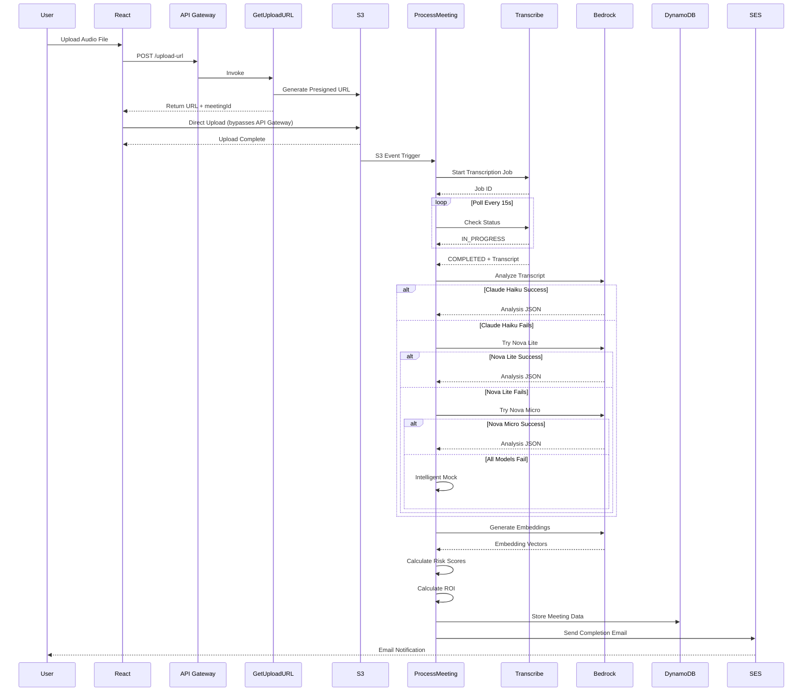

### 2. Action Item Management Flow

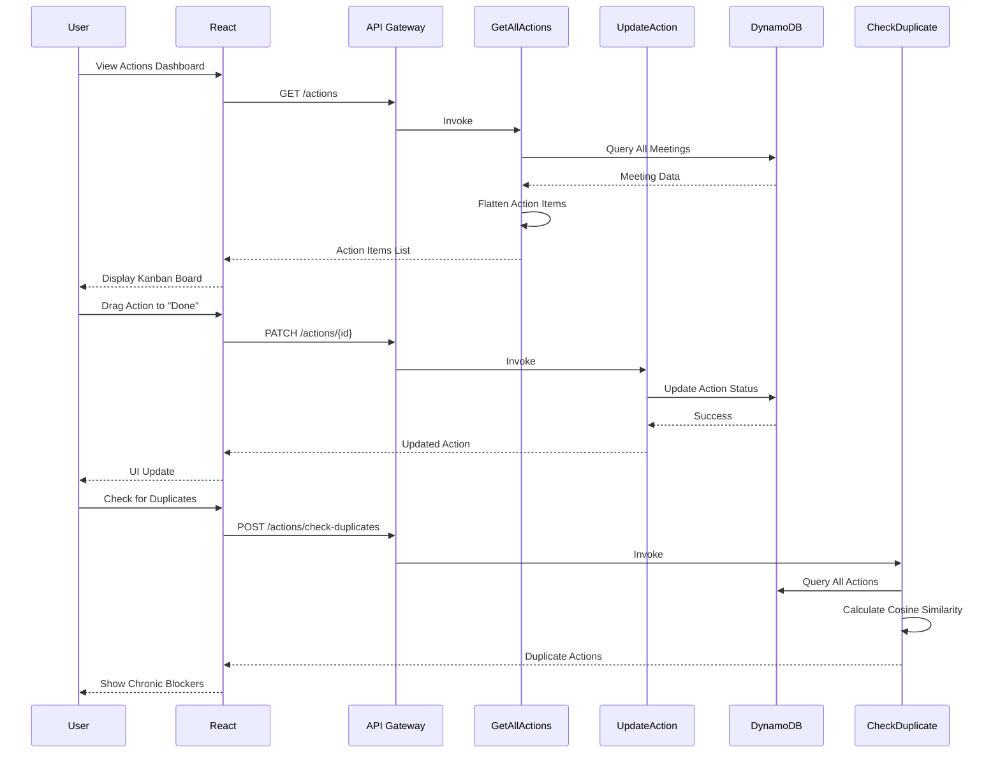

### 3. Team Collaboration Flow

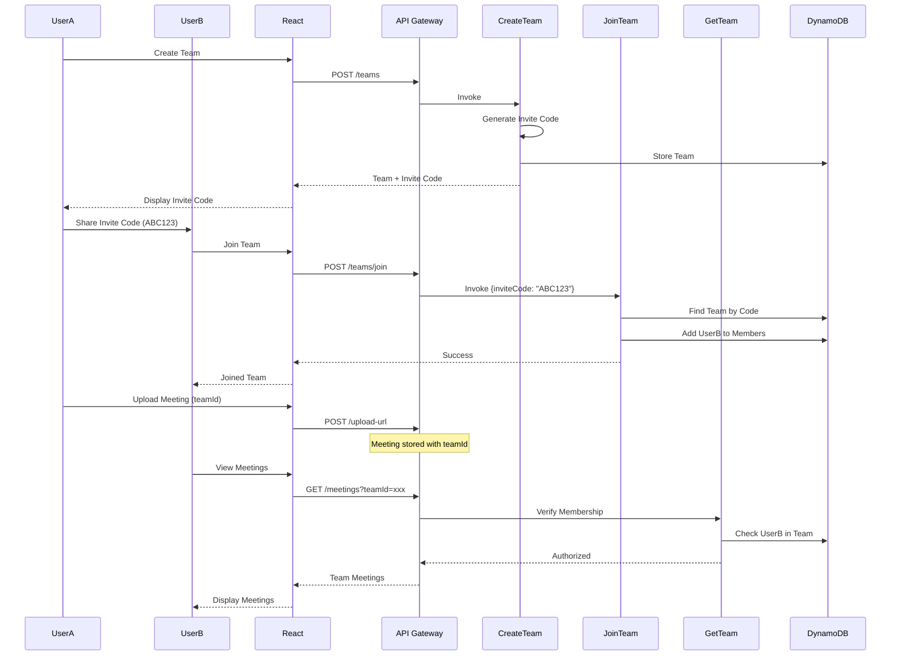

## Component Architecture

### Frontend Components

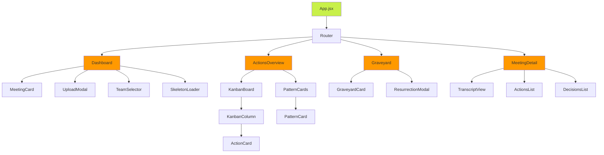

### Backend Lambda Organization

```mermaid
graph TD
    A[Lambda Functions] --> B[Core]
    A --> C[Features]
    A --> D[Teams]
    A --> E[Auth]
    A --> F[Infrastructure]
    
    B --> B1[get-upload-url]
    B --> B2[process-meeting]
    B --> B3[get-meeting]
    B --> B4[list-meetings]
    B --> B5[get-all-actions]
    B --> B6[update-action]
    
    C --> C1[check-duplicate]
    C --> C2[get-debt-analytics]
    C --> C3[send-reminders]
    C --> C4[generate-epitaphs]
    
    D --> D1[create-team]
    D --> D2[join-team]
    D --> D3[get-team]
    D --> D4[list-user-teams]
    
    E --> E1[pre-signup]
    E --> E2[post-confirmation]
    E --> E3[send-welcome-email]
    
    F --> F1[dlq-handler]
    F --> F2[daily-digest]
    
    style B2 fill:#ff9900,stroke:#333,stroke-width:3px
    style C1 fill:#9b59b6
    style C2 fill:#9b59b6
```

## Database Schema

### DynamoDB Tables

```mermaid
erDiagram
    MEETINGS ||--o{ ACTIONS : contains
    MEETINGS }o--|| USERS : "belongs to"
    MEETINGS }o--o| TEAMS : "optional team"
    TEAMS ||--o{ USERS : "has members"
    
    MEETINGS {
        string userId PK
        string meetingId SK
        string title
        string status
        string s3Key
        string transcript
        string summary
        array decisions
        array actionItems
        array followUps
        object roi
        string teamId
        string email
        datetime createdAt
        datetime updatedAt
    }
    
    ACTIONS {
        string id
        string task
        string owner
        date deadline
        boolean completed
        string status
        datetime completedAt
        number riskScore
        string riskLevel
        array embedding
        datetime createdAt
    }
    
    TEAMS {
        string teamId PK
        string name
        string createdBy
        array members
        string inviteCode
        datetime createdAt
        datetime updatedAt
    }
    
    USERS {
        string userId
        string email
        string name
        datetime createdAt
    }
```

## Deployment Architecture

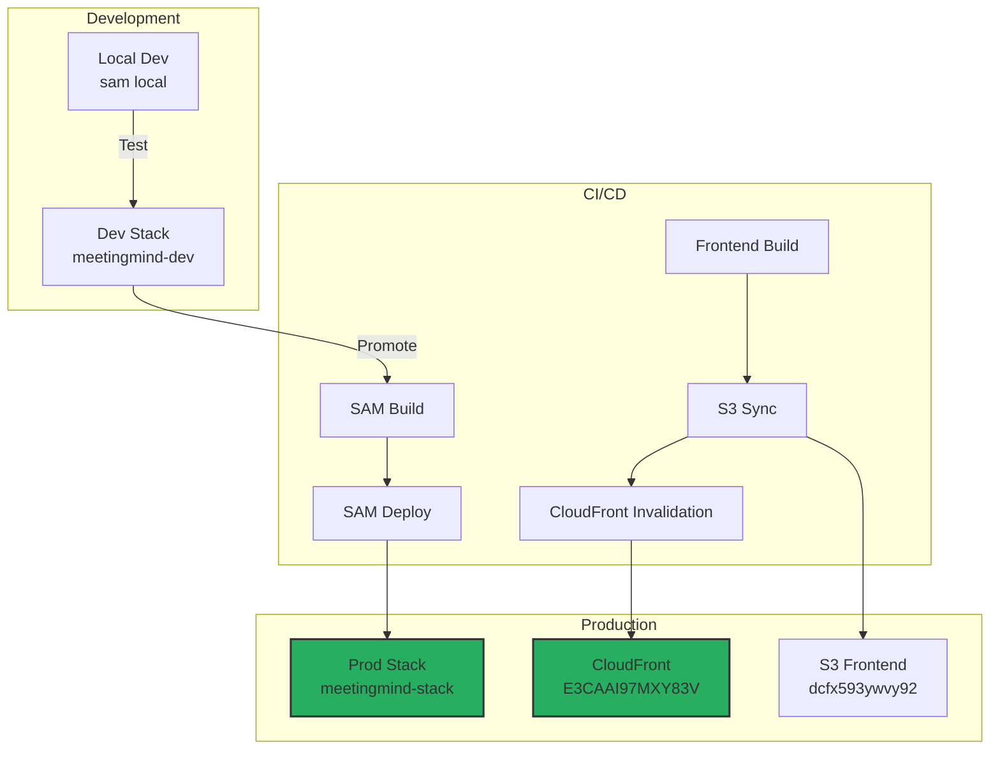

## Cost Optimization Strategy

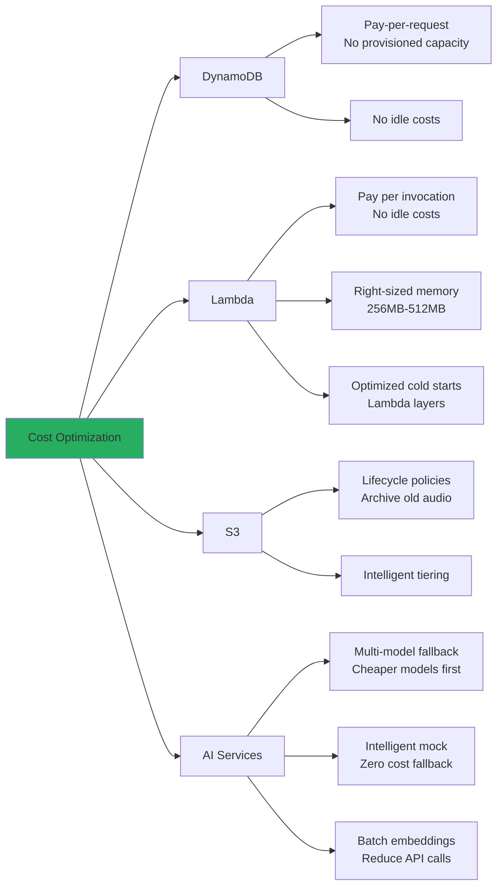

## Security Architecture

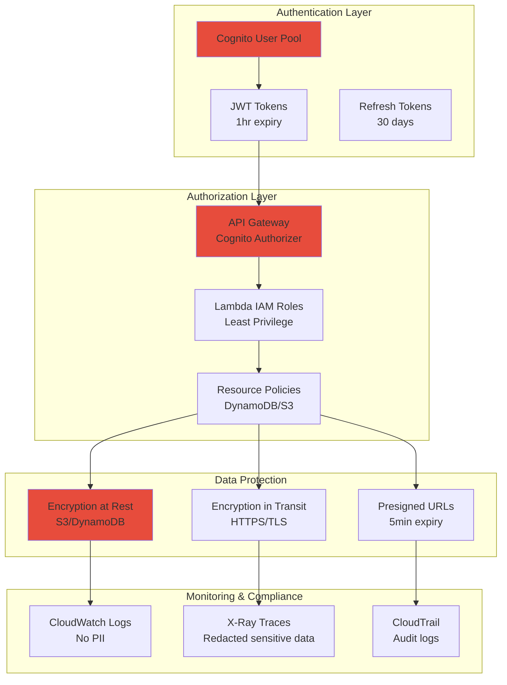

## Monitoring & Observability

```mermaid
graph TB
    subgraph "Logging"
        A1[CloudWatch Logs]
        A2[7-day Retention]
        A3[Structured JSON]
    end
    
    subgraph "Tracing"
        B1[X-Ray Tracing]
        B2[Subsegments]
        B3[Service Map]
    end
    
    subgraph "Metrics"
        C1[CloudWatch Metrics]
        C2[Custom Dashboard]
        C3[Alarms]
    end
    
    subgraph "Error Handling"
        D1[Dead Letter Queue]
        D2[DLQ Handler]
        D3[SNS Alerts]
    end
    
    A1 --> A2
    A2 --> A3
    
    B1 --> B2
    B2 --> B3
    
    C1 --> C2
    C2 --> C3
    
    D1 --> D2
    D2 --> D3
    
    style C3 fill:#e74c3c
    style D3 fill:#e74c3c
```

## Performance Optimization

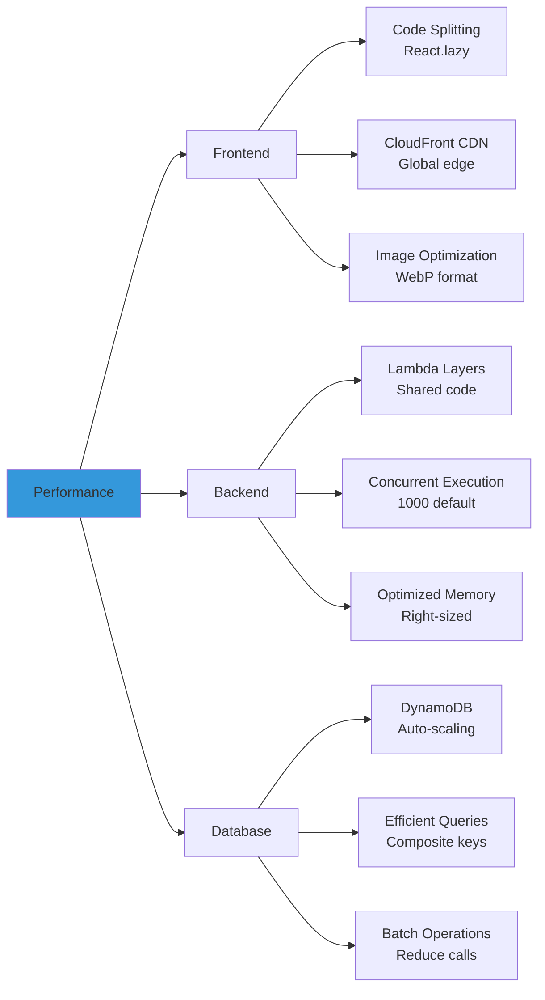
